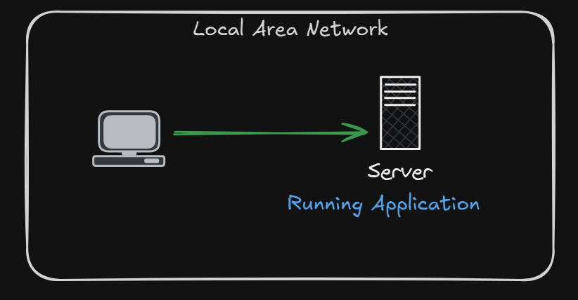
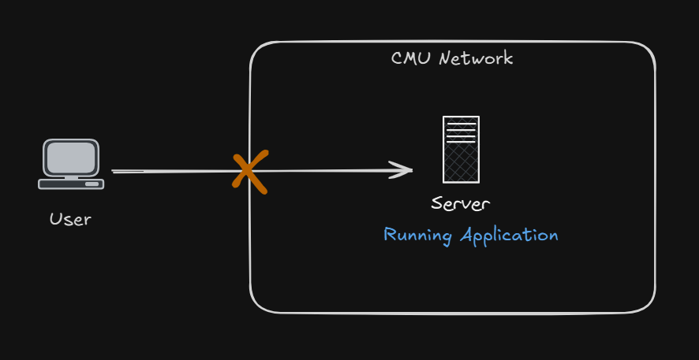
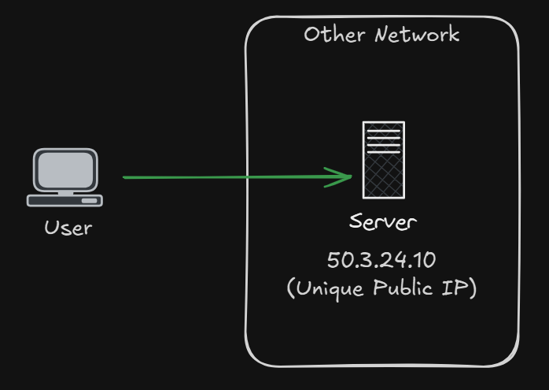
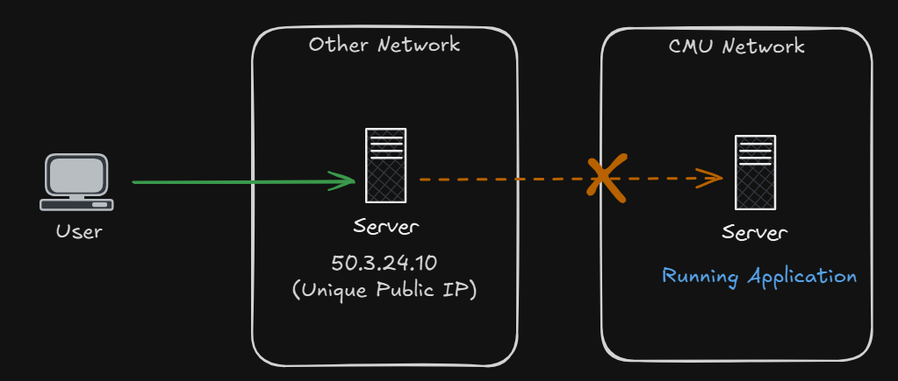
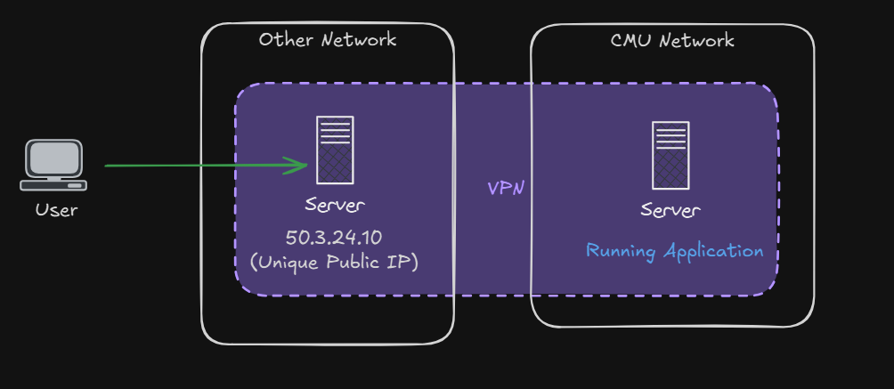
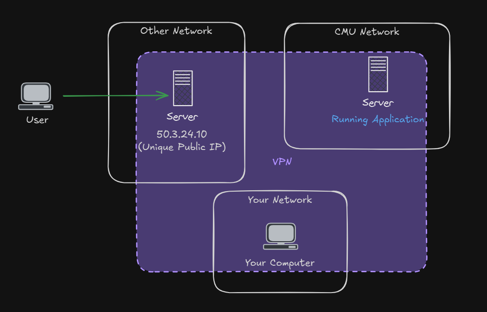

# Information Technology for Logistics

---

# Objective

- Deploying and mangaing cloud applications.
  - Web application (PHP)
  - Automation tool (n8n)
  - Enterprise resource planning software (ERPNext)
- Designing integrated IT workflow connecting these systems for logistics operations.

---

# Skill

- Cloud service and networking.
- System administration
- Logistics/business-flow design

---

# Work

- Assignment (25%)
- Project (25%)

---

# Part 1: Cloud Service

---

# Within Same LAN

- Computers within the same LAN can connect.
  

---

# Outside LAN

---

# Outside LAN

- `CMU` gateway (router) would not allow it.
  - For security
- Share public IP problem.

---

# Test Connectivity - `ping`

- `ping google.com` (working)
- Trying `ping` your computer's public IP.

---

# DNS

- _Domain Name System_
- Internet protocol that translates human-readable domain names (like example.com) into machine-readable IP addresses (like 93.184.216.34)
- `dig google.com`

---

# Server with Public IP

---

# Test Server Connection

- `ping iecmu.com`
- Can you find out what the ip address is?

---

# Same Problem

---

# VPN

- Virtual Private Network
- Technology that creates a secure, encrypted connection over the internet
  - Allowing private network access from remote or public locations.
- As if computers are in the same LAN.

---

---

---

# Task: VPN Connection

- Connect to VPN.
- You should be able to `ping` the server IP and local URL.
- Can you find out the ip address in the VPN?

---

# Linux fundamentals

- Log into the your server.
  - `ssh admin@10.66.66.x`
- Perform basic tasks
  - Navigation
  - `nano`
  - `sudo` concept
