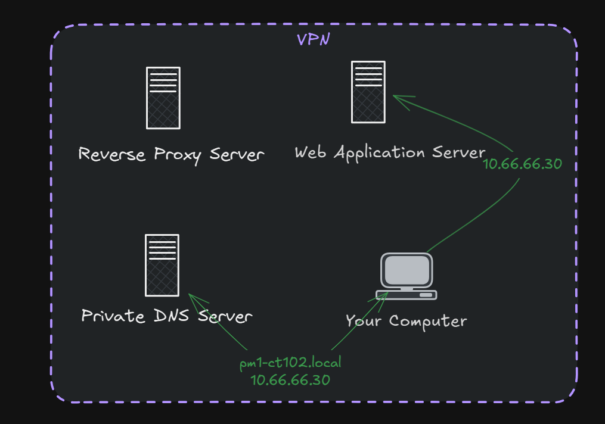
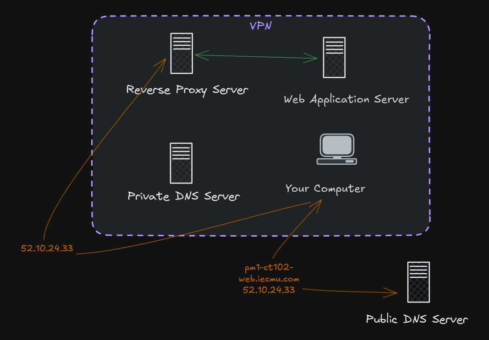

<style>
@import url('https://fonts.googleapis.com/css2?family=Prompt:ital,wght@0,100;0,300;0,400;0,700;1,100;1,300;1,400;1,700&display=swap');

    :root {
    font-family: Prompt;
    --hl-color: #D57E7E;
}
h1 {
  font-family: Prompt
}
</style>

# Information Technology for Logistics

---

# Part 1: Web Application (PHP)

> Example: https://pm1-ct102-web.iecmu.com

---

# LEMP Stack

The **LEMP stack** is a web hosting stack alternative to LAMP, where Apache is replaced with **Nginx (pronounced Engine‑X)**:

- 🐧 **Linux** – operating system
- 🌍 **Nginx** – web server
- 🐬 **MariaDB** – database engine (MySQL compatible)
- 🐘 **PHP-FPM** – processes dynamic content

---

# Guides

- [Nginx](https://github.com/nnnpooh/info-tech-logis-68/blob/main/src/T02_web/guides/S01_nginx.md)
- [MariaDB](https://github.com/nnnpooh/info-tech-logis-68/blob/main/src/T02_web/guides/S02_db.md)
- [PHP](https://github.com/nnnpooh/info-tech-logis-68/blob/main/src/T02_web/guides/S03_php.md)
- [Web Service](https://github.com/nnnpooh/info-tech-logis-68/blob/main/src/T02_web/guides/S04_web.md)

---

# Using Local URL

`pm1-ct102.local`


---

# Using Public URL

`pm-ct102-web.iecmu.com`



---

# Let's make a bookstore website

---

# Setup Database

```sql
CREATE DATABASE IF NOT EXISTS iebookstore;
```

---

# Setup Database

```sql
CREATE TABLE IF NOT EXISTS iebookstore.booklist (
  isbn VARCHAR(20) PRIMARY KEY,
  title VARCHAR(255) NOT NULL
);

CREATE TABLE IF NOT EXISTS orderdetail (
  orderID INT AUTO_INCREMENT PRIMARY KEY,
  isbn VARCHAR(20) NOT NULL,
  quantity INT NOT NULL,
  FOREIGN KEY (isbn) REFERENCES booklist(isbn)
);
```

---

# Setup Database

```sql
INSERT INTO iebookstore.booklist
            (isbn,
             title)
VALUES      ('9780135166307',
             'Clean Code'),
            ('9781491957660',
             'Fluent Python'),
            ('9780132350884',
             'Clean Architecture');
```

---

# PHP

- [`index.php`](https://github.com/nnnpooh/info-tech-logis-68/blob/main/src/T02_web/codes/index.php)
- [`booklist.php`](https://github.com/nnnpooh/info-tech-logis-68/blob/main/src/T02_web/codes/booklist.php)
- [`bookadd.php`](https://github.com/nnnpooh/info-tech-logis-68/blob/main/src/T02_web/codes/bookadd.php)
- [`orderlist.php`](https://github.com/nnnpooh/info-tech-logis-68/blob/main/src/T02_web/codes/orderlist.php)
- [`orderadd.php`](https://github.com/nnnpooh/info-tech-logis-68/blob/main/src/T02_web/codes/orderadd.php)
