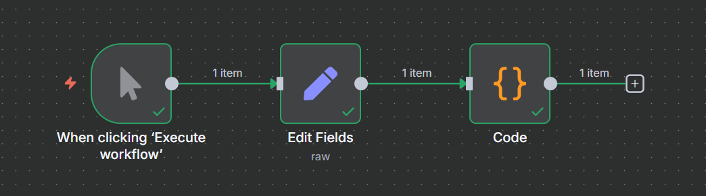
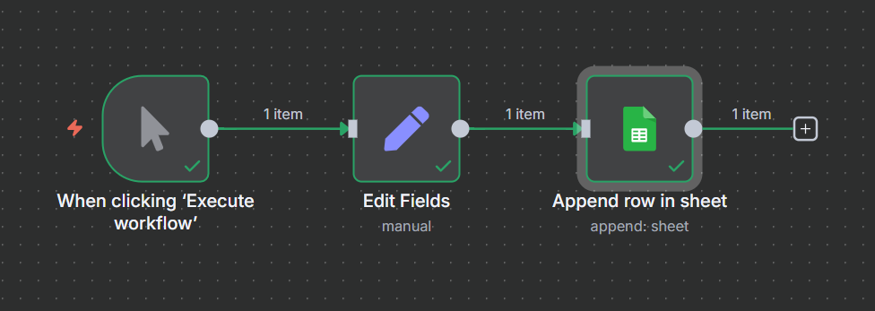
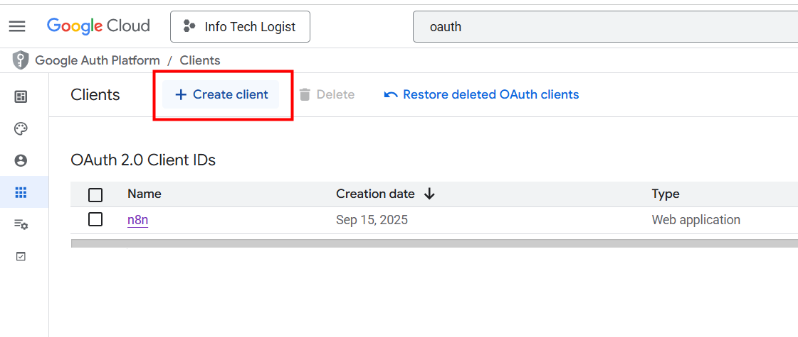
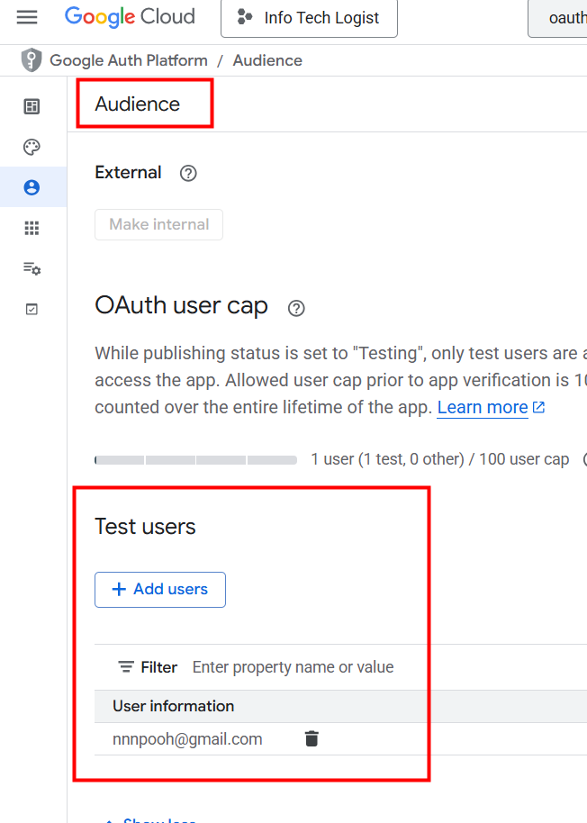
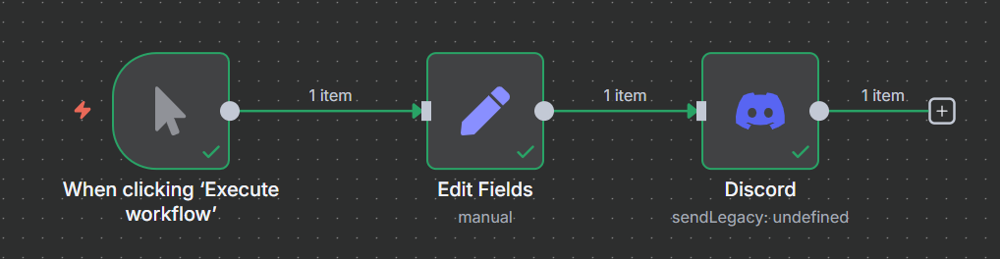

<style>
@import url('https://fonts.googleapis.com/css2?family=Prompt:ital,wght@0,100;0,300;0,400;0,700;1,100;1,300;1,400;1,700&display=swap');

    :root {
    font-family: Prompt;
    --hl-color: #D57E7E;
}
h1 {
  font-family: Prompt
}
</style>

# Information Technology for Logistics

---

# Part 2: N8N

---

What is it?

> `n8n` is an open-source workflow automation tool that allows users to automate tasks and connect different apps, services, and APIs using a simple, visual interface.

---

# Installation

[Guide](https://github.com/nnnpooh/info-tech-logis-68/blob/main/src/T03_n8n/guides/n8n.md)

---

# Basic Flow 1



---

# Google Sheet



---

# Google Sheet

- Create new project in Google Cloud Platform
- Enable Google Sheet API
- Create "App" from the "Consent Screen"
- Create client from the app
- Add test user
- Enable Google Drive API

---

# Create Client



---

# Add Test User



---

# Notification



---

# Sensor

---

```sql
CREATE TABLE IF NOT EXISTS sensor_light (
  id INT PRIMARY KEY AUTO_INCREMENT,
  value VARCHAR(20) NOT NULL UNIQUE,
  created_at TIMESTAMP DEFAULT CURRENT_TIMESTAMP
);
```

---

# Bookstore System

```sql
ALTER TABLE iebookstore.orderdetail
ADD COLUMN IF NOT EXISTS created_at TIMESTAMP DEFAULT CURRENT_TIMESTAMP;
```
