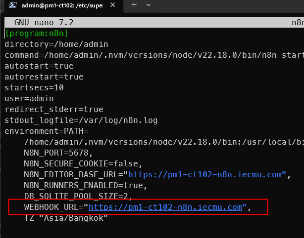
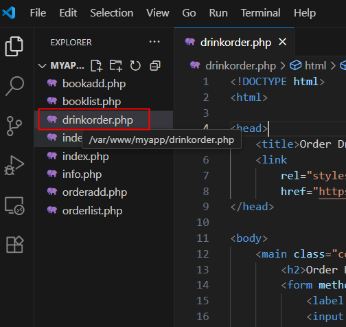
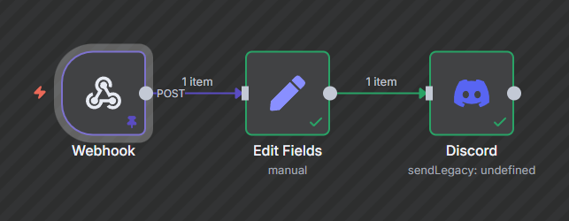

<style>
@import url('https://fonts.googleapis.com/css2?family=Prompt:ital,wght@0,100;0,300;0,400;0,700;1,100;1,300;1,400;1,700&display=swap');

    :root {
    font-family: Prompt;
    --hl-color: #D57E7E;
}
h1 {
  font-family: Prompt
}
</style>

# Information Technology for Logistics

---

# Part 2: N8N

---

What is it?

> `n8n` is an open-source workflow automation tool that allows users to automate tasks and connect different apps, services, and APIs using a simple, visual interface.

---

# Installation

[Guide](https://github.com/nnnpooh/info-tech-logis-68/blob/main/src/T03_n8n/guides/n8n.md)

---

# Basic Flow 1


---

# Google Sheet


---

# Google Sheet

- Create a new `project` in Google Cloud Platform
- Enable `Google Sheet API`
- Create `App` from the `Consent Screen`
- Create a `client` from the `App`
- Add a test `user`
- Enable `Google Drive API`

---

# Create Client


---

# Add Test User


---

# Notification


---

# Drink Ordering System

> Connecting Web Application to Other Services

---

# Install `curl` in `php`

- `sudo apt-get install php-curl`
- `sudo systemctl restart nginx`
- `php -m`


---

# Modify `n8n` config

- `sudo nano /etc/supervisor/conf.d/n8n.conf`
- Add this line _(see next page)_

```
WEBHOOK_URL="https://pmX-ctXXX-n8n.iecmu.com",
```

- `sudo systemctl restart supervisor`

---



---

# Database

- Create a new database

```sql
CREATE DATABASE IF NOT EXISTS iedrink;
```

- Create a new table

```sql
CREATE TABLE IF NOT EXISTS iedrink.orders (
  id INT NOT NULL AUTO_INCREMENT,
  drink_name VARCHAR(100),
  customer_name VARCHAR(100),
  quantity INT,
  created_at TIMESTAMP DEFAULT CURRENT_TIMESTAMP,
  PRIMARY KEY (id)
);
```

---

# Web Application

- Create `drinkorder.php` [(Link)](https://github.com/nnnpooh/info-tech-logis-68/blob/main/src/T03_n8n/codes/drinkorder.php)
  - Modify your database credential.
- Visit your page at https://pmX-ctXXX-web.iecmu.com/drinkorder.php

---



---

# Webhook Flow



- Also you can write the data into Google Sheet.

---

# Sensor

> Storing Sensor Data

---

# Database

- Create a new database

```sql
CREATE DATABASE IF NOT EXISTS sensor;
```

```sql
CREATE TABLE IF NOT EXISTS sensor.light (
  id INT AUTO_INCREMENT PRIMARY KEY,
  sensor_name VARCHAR(50),
  sensor_value FLOAT,
  created_at TIMESTAMP DEFAULT CURRENT_TIMESTAMP
);
```
