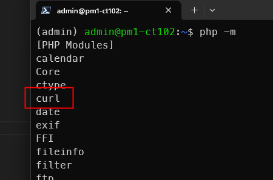

<style>
@import url('https://fonts.googleapis.com/css2?family=Prompt:ital,wght@0,100;0,300;0,400;0,700;1,100;1,300;1,400;1,700&display=swap');

    :root {
    font-family: Prompt;
    --hl-color: #D57E7E;
}
h1 {
  font-family: Prompt
}
</style>

# Information Technology for Logistics

---

# Part 2: N8N

---

What is it?

> `n8n` is an open-source workflow automation tool that allows users to automate tasks and connect different apps, services, and APIs using a simple, visual interface.

---

# Installation

[Guide](https://github.com/nnnpooh/info-tech-logis-68/blob/main/src/T03_n8n/guides/n8n.md)

---

# Basic Flow 1


---

# Google Sheet


---

# Google Sheet

- Create a new `project` in Google Cloud Platform
- Enable `Google Sheet API`
- Create `App` from the `Consent Screen`
- Create a `client` from the `App`
- Add a test `user`
- Enable `Google Drive API`

---

# Create Client


---

# Add Test User


---

# Notification


---

# Drink Ordering System

> Connecting Web Application to Other Services

---

# Install `curl` in `php`

- `sudo apt-get install php-curl`
- `sudo systemctl restart nginx`
- `php -m`



---

# Modify `n8n` config

- `sudo nano /etc/supervisor/conf.d/n8n.conf`
- Add this line _(see next page)_

```
WEBHOOK_URL="https://pmX-ctXXX-n8n.iecmu.com",
```

- `sudo systemctl restart supervisor`

---


---

# Database

- Create a new database

```sql
CREATE DATABASE IF NOT EXISTS iedrink;
```

- Create a new table

```sql
CREATE TABLE IF NOT EXISTS iedrink.orders (
  id INT NOT NULL AUTO_INCREMENT,
  drink_name VARCHAR(100),
  customer_name VARCHAR(100),
  quantity INT,
  created_at TIMESTAMP DEFAULT CURRENT_TIMESTAMP,
  PRIMARY KEY (id)
);
```

---

# Web Application

- Create `drinkorder.php` [(Link)](https://github.com/nnnpooh/info-tech-logis-68/blob/main/src/T03_n8n/codes/drinkorder.php)
  - Modify your database credential.
- Visit your page at https://pmX-ctXXX-web.iecmu.com/drinkorder.php

---


---

# Webhook Flow


---

# Webhook


---

# Edit Fields


---

# Discord


---

# Discord

```
Customer {{ $json.body.customer_name }} ordered {{ $json.body.drink_name }} for
{{ $json.body.quantity }} at
{{ $json.body.created_at }}.
```

---

# Extra

> Can you write the data into Google Sheet too?

---

# MQTT

- MQTT is a Client Server publish/subscribe messaging transport protocol.
- It is light weight, open, simple, and designed so as to be easy to implement.
- Ideal for use in many situations
  - Machine to Machine (M2M)
  - **Internet of Things (IoT)**

---

# Publish/subscribe pattern

- The publish/subscribe pattern (also known as `pub/sub`) provides an **alternative** to traditional client-server architecture.
  - In client-server architecture, a client communicates directly with an endpoint.

---

# Broker

- The connection between `publishers` and `subscibers` is handled by a third component (the `broker`).
- The job of the broker is to filter all incoming messages and distribute them correctly to subscribers.

---


---

# Sensor

> Storing Sensor Data

---

# Sensor Connection

- Set WiFi according to this [info](https://docs.google.com/spreadsheets/d/1qZ7A6i4H2qOtFvjGiaMUvaEbW06_KyEgXNIk_YLeZwg/edit?usp=sharing).
- Turn on the sensor.

---

# Database

- Create a new database

```sql
CREATE DATABASE IF NOT EXISTS sensor;
```

```sql
CREATE TABLE IF NOT EXISTS sensor.light (
  id INT AUTO_INCREMENT PRIMARY KEY,
  sensor_name VARCHAR(50),
  sensor_value FLOAT,
  created_at TIMESTAMP DEFAULT CURRENT_TIMESTAMP
);
```

---

# Database Record Flow


---

# MQTT

- Topic: `Test00/Light/Value`
  

---

# Edit Fields


---

# MySQL Node


---

# Viewing Data


---

# MySQL


---

# MySQL

```sql
SELECT *
FROM light
WHERE created_at >= DATE_SUB(NOW(), INTERVAL 3 MINUTE);
```

---

# Summarize


---

# Quick Chart


---

# Webhook


---

# Respond to Webhook


---

# Web Application

- Create `sensor.php` on the webserver. [(Link)](https://github.com/nnnpooh/info-tech-logis-68/blob/main/src/T03_n8n/codes/sensor.php)
  - Fix the webhook link accordingly.


---

# Actuator

> Controlling devices

---

# Control Flow


---

# Webhook


---

# Webhook

We want to send the following (using query parameter)

- ON: https://pmX-ctXXX-n8n.iecmu.com/webhook/led?led=on
- OFF: https://pmX-ctXXX-n8n.iecmu.com/webhook/led?led=off

---

# Edit Fields


---

# MQTT

- Topic: `Light/TestMQTTin`


---

# Web Application

- Uncomment


